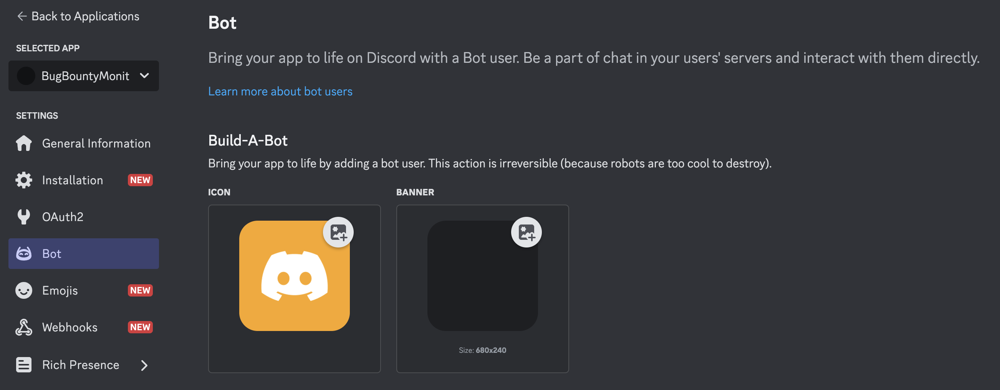
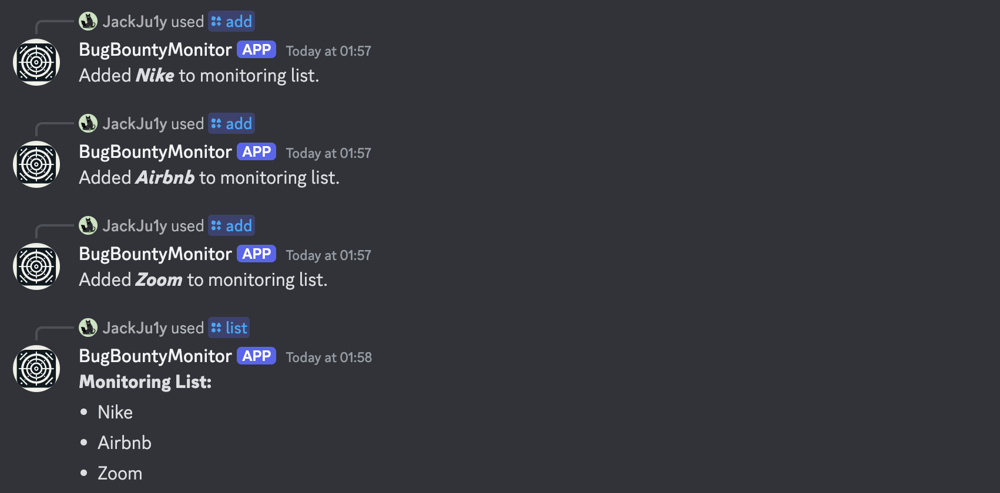
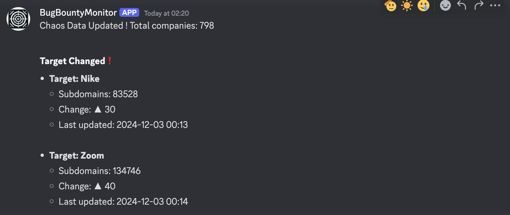

# Bug Bounty Monitor

English | [中文](README_zh.md)

🎬[**Youtube Demo**](https://www.youtube.com/watch?v=31ocxVjui-M)

## Introduction

A basic Bug Bounty programs monitoring tool using [Discord Bot](https://discord.com/).

You can check the development process and installation steps of this script on [my blog](https://www.ju1y.top/blogs/4).

**Main Features**

- Set up a monitoring list with support for adding and removing targets.
- Daily monitoring of targets to get Subdomain count and changes.
- Query specific targets to get Subdomain count, Bug Bounty project platform, and project URL, with support to download all subdomains.

**Data Sources**

- This monitoring script uses data from the **ProjectDiscovery** [**Chaos**](https://chaos.projectdiscovery.io/) project page.
- The target query range is based on the data collected from **ProjectDiscovery** [**Public BugBounty Programs**](https://github.com/projectdiscovery/public-bugbounty-programs).

## Installation

- Create a new **Application** in the **[Discord Developer Portal](https://discord.com/developers/applications)**.
- In the **Bot** page, create a Bot and get the **TOKEN**.
  - You need to check the **Message Content Intent** in the **Privileged Gateway Intents**.
- Use this URL format to invite the Bot to your server: https://discord.com/api/oauth2/authorize?client_id=CLIENT_ID&permissions=PERMISSIONS_INTEGER&scope=bot+applications.commands
  - `CLIENT_ID` can be obtained from the **OAuth2** page.
  - `PERMISSIONS_INTEGER` can be calculated from the **Bot** page. The minimum permissions required for this tool can be set to 3072.
  - 
- Download the project: `git clone https://github.com/JackJuly/bugbounty-monitor-bot`.
- Install dependencies: `pip install discord`.
- Run the script: `python ./BountyMonBot.py`.

## Usage

- `/help`: Show this help message.
  - Displays a list of available commands and their descriptions.
- `/query <target>`: Query information about a specific target.
  - Provides details of the target, including subdomains, platform, and last updated time.
- `/list`: Show the current monitoring targets.
  - Displays the list of all targets currently being monitored.
- `/add <target>`: Add a target to the monitoring list.
  - Adds a target to the monitoring list based on the target name.
- `/del <target>`: Remove a target from the monitoring list.
  - Removes a target from the monitoring list by the target name.

## TODO

- Query newly added projects
- List specific newly added Subdomains
- Independent subdomain query feature
- JavaScript files Monitoring

**This script only implements very BASIC monitoring and query functions. You can customize and add more useful features, and feel free to share them here.**

