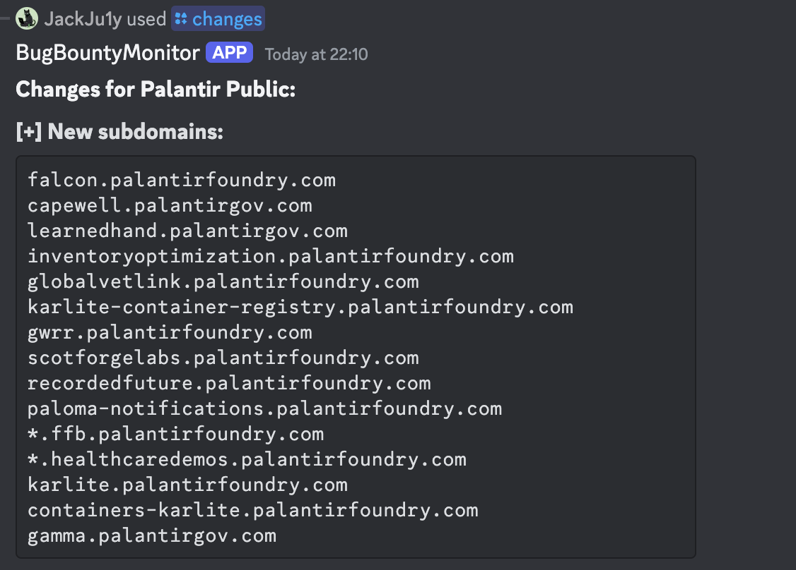
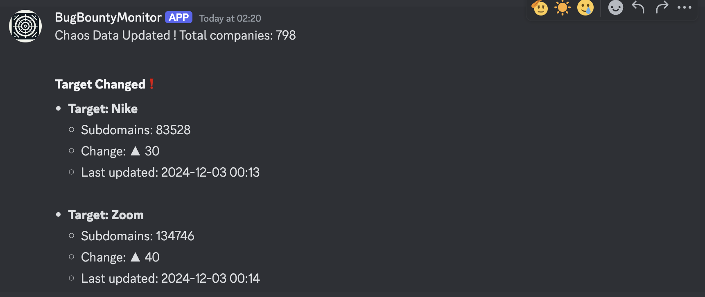
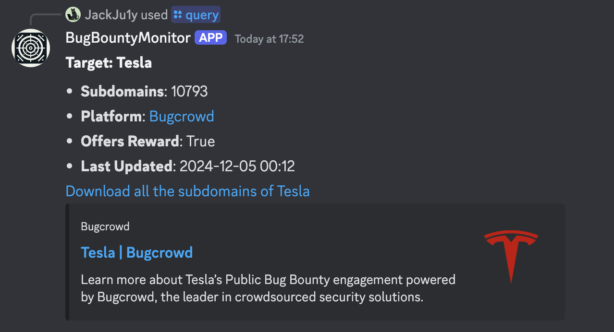

# Bug Bounty Monitor

[English](README.md) | 中文

🎬[**YouTube 演示**](https://www.youtube.com/watch?v=31ocxVjui-M)

## 介绍

使用[Discord Bot](https://discord.com/) 实现的基础 Bug Bounty Monitor。

可以在[我的博客](https://www.ju1y.top/blogs/4)中查看此脚本的编写过程及安装步骤。

**主要功能**

- 设置监控列表，支持新增、删除目标
- 每日监控目标，获取 Subdomain 数及变化
- 查询指定目标，获取 Subdomain 数、Bug Bounty 项目平台及项目地址，支持下载所有子域名

**数据来源**

- 本监控脚本数据源基于 **ProjectDiscovery** [**Chaos**](https://chaos.projectdiscovery.io/) 项目页面
- 查询目标范围基于 **ProjectDiscovery** [**Public BugBounty Programs**](https://github.com/projectdiscovery/public-bugbounty-programs) 收录数据

## 安装说明

- 在 **[Discord Developer Portal](https://discord.com/developers/applications)**中新建 **Application**
- 在 **Bot** 页面中创建 Bot 并获取 **TOKEN**
  - Privileged Gateway Intents 中需要勾选 Message Content Intent
- 使用此 URL 格式邀请 Bot 到你的服务器：https://discord.com/api/oauth2/authorize?client_id=CLIENT_ID&permissions=PERMISSIONS_INTEGER&scope=bot+applications.commands
  - `CLIENT_ID` 可在 **OAuth2** 页面中获取
  - `PERMISSIONS_INTEGER` 可在 **Bot** 页面中计算，本工具最低需要的权限可设置为 3072
  - 
- 下载本项目：`git clone https://github.com/JackJuly/bugbounty-monitor-bot`
- 安装依赖：`pip install discord`
- 运行脚本：`python ./BountyMonBot.py`

## 使用说明

- `/help`：显示帮助信息。
  - 显示可用命令及其描述的列表。
- `/query <target>`：查询特定目标的信息。
  - 提供目标的详细信息，包括子域名、平台和最后更新时间。
- `/list`：显示当前的监控目标。
  - 显示当前所有被监控的目标列表。
- `/add <target>`：添加目标到监控列表。
  - 根据目标名称将目标添加到监控列表中。
- `/del <target>`：从监控列表中移除目标。
  - 根据目标名称从监控列表中移除目标。
- `/update`: 手动更新 Chaos 数据。
  - 从 ProjectDiscovery API 获取并更新 Chaos 数据。
- `/stats`: 显示 Chaos 数据统计信息。
  - 显示 Chaos 数据的统计信息，包括总项目数、新增项目以及变更。
- `/new` : 显示新的项目。
  - 列出来自 Chaos 数据的新项目。
- `/changes <target>` : 显示特定目标的域名变更。
  - 显示给定目标的域名和子域名变更情况。
- `/changes_since <target>` : 显示自添加到监控列表以来特定目标的域名变更。
  - 显示自添加到监控列表以来给定目标的域名和子域名变更情况。

## 更新

- 新增 `update` 命令，可手动更新数据。
- 新增 `new` 命令，可查询新的 bug bounty 项目。
- 新增 `stats` 命令，可查询 Chaos 数据的统计信息。
- 新增 `changes`，`changes_since` 命令，可查询特定目标的域名变更，并列出新增/移除的子域名明细。

## TODO

- [x] 新增项目查询
- [x] 列出具体的新增 Subdomains
- [ ] 独立的子域名查询功能
- [ ] JavaScript 文件监控

**此脚本实现的只是非常基本的监控查询功能，你可以自定义添加更多实用功能，也欢迎在此分享**

